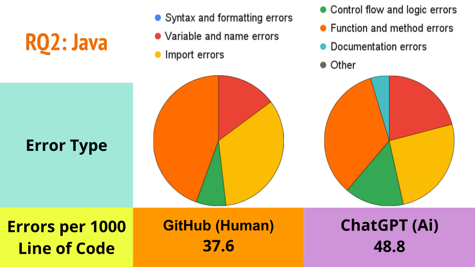

# CodeQuality4DevGPT

CodeQuality4DevGPT is a project focused on identifying quality issues in code generated by ChatGPT. By utilizing various linters, this project aims to analyze the code for errors ranging from minor stylistic issues to more critical logical and efficiency problems. The analyzed code is sourced from the [DevGPT database](https://github.com/NAIST-SE/DevGPT) and [GitHub API](https://docs.github.com/en/rest?apiVersion=2022-11-28).

## Study Overview

Study: [Beyond Generation: A Comparative Analysis of Quality Issues in ChatGPT-Produced Code Across Programming Languages](Study_Information/Beyond_Generation_A_Comparative_Analysis_of_Quality_Issues_in_ChatGPT_Produced_Code_Across_Programming_Languages.pdf)

Raw Data: [Data](https://github.com/ahabegger/CodeQuality4DevGPT/tree/main/Study_Information/Raw_Data)

Classified Data: [Data](https://github.com/ahabegger/CodeQuality4DevGPT/blob/main/Study_Information/Study_Data.xlsx)

This study aims to evaluate the quality of code generated by ChatGPT across multiple programming languages including Python, Java, and JavaScript. By employing a set of robust linters—Pylint for Python, PMD for Java, and JSHint for JavaScript—the research scrutinizes common issues such as stylistic inconsistencies, logical errors, and severe programming flaws within the code samples sourced from the DevGPT database. This analysis not only identifies prevalent problems but also assesses the strengths and weaknesses of each linter in detecting these issues, offering a comparative insight that informs on potential areas for enhancement in AI-generated code.

**Research Question 1**: How does ChatGPT Perform Across Programming Languages?


Further, the findings contribute significantly to understanding the limitations and capabilities of AI in coding, which is crucial for integrating AI tools more effectively into software development workflows. By highlighting common pitfalls in AI-generated code and providing empirically driven recommendations for best practices, the study aims to improve the reliability and productivity of AI as a development tool. This research aligns with the objectives of the MSR 2024 Mining Challenge, thereby advancing the broader agenda of enhancing code quality in the era of AI-assisted programming.

**Research Question 2**: What are the Differences Between AI-Generated and Human-Written Code?





## Prerequisites

Before you begin, ensure you have the following installed:
- **Python 3.7**: Download [here](https://www.python.org/downloads/)
- **Pip Env**
- **Java 8** or above

## Installation

1. **Clone the repository**:
   ```bash
   git clone https://github.com/ahabegger/CodeQuality4DevGPT.git
   ```

2. **Set up Python packages**:
   Navigate to the `CodeQuality4DevGPT` folder and install the required packages:
   ```bash
   pip install -r requirements.txt
   ```

3. **Set up Linters**:
   - **JSHint**:
     - Set up an NPM environment and install JSHint using the instructions [here](https://jshint.com/install/).
     ```bash
     npm install -g jshint
     npm fund
     ```
   - **PMD**:
     - Download PMD from [PMD GitHub](https://pmd.github.io/) and follow the installation guide [here](https://docs.pmd-code.org/latest/pmd_userdocs_installation.html).

4. **Setting Up GitHub API**:
   Within the `CodeQuality4DevGPT` folder, create a `token.txt` file and store your GitHub token:
   ```bash
   touch token.txt
   echo "{GITHUB Token}" > token.txt
   ```

## Usage

Navigate to the `CodeQuality4DevGPT` folder and run the following commands to execute the programs:
```bash
python ChatGPTCode
python HumanCode
```
Output files will be located in the `Output` folder.

### Classifying Errors

Follow the classification instructions provided in Appendix A of the Study

## Linters

- **Python**: [Pylint](https://pypi.org/project/pylint/)
- **Java**: [PMD](https://pmd.github.io/)
- **JavaScript**: [JSHint](https://www.jslint.com/)

## Contributing

Contributions to improve CodeQuality4DevGPT are welcome. Please ensure to update tests as appropriate.

## License

This project is licensed under the MIT License - see the [LICENSE](LICENSE) file for details.

## Additional Resources

- [MSR 2024 Mining Challenge](https://2024.msrconf.org/track/msr-2024-mining-challenge#challenge)
- [DevGPT GitHub Repository](https://github.com/NAIST-SE/DevGPT)
